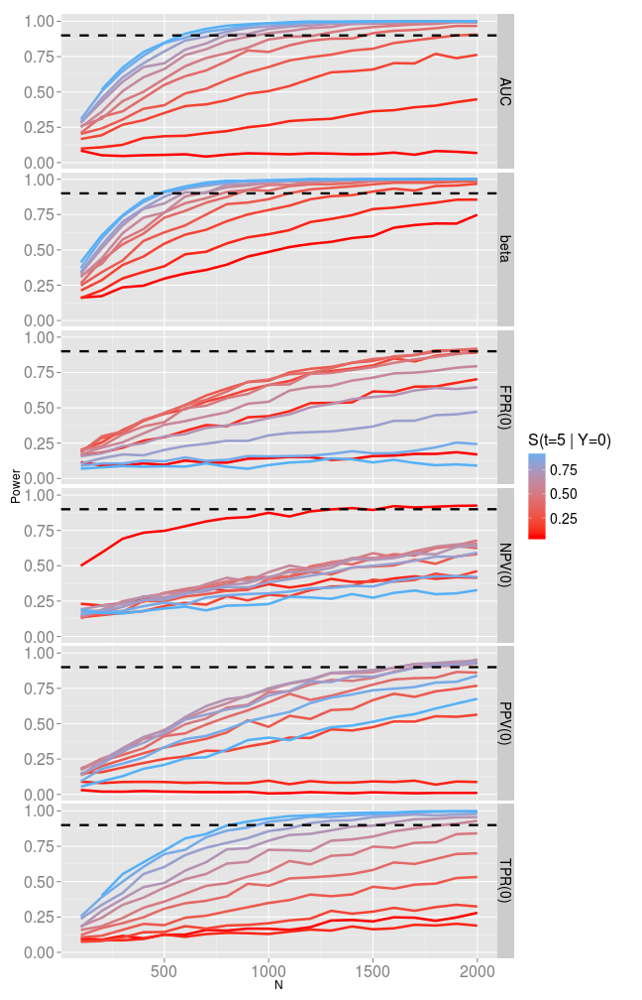

PowerSAM_sims
=============

simulation study to learn more about the performance of PowerSAM 

I want to build a plot of N by power for all the different measures. 

Test of AUC <= .6 vs AUC > .6 when the true AUC = .65

S0 is baseline survival at prediction time (5 years)

 - $Y \sim N(0,1)$
 - Measures estimated at $t_{predict} = 5$ with marker cutpoint value $c = 0$ 

 

